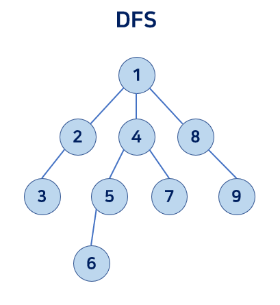
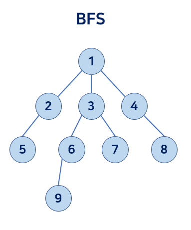

## DFS Depth First Search
루트 노드(또는 다른 임의 노드)에서 시작해서 다음 분기로 넘어가기 전 해당 분기를 완벽하게 탐색하는 방법  
우선 **깊게** 탐색한다.  
그래프 탐색의 경우, 어떤 노드를 방문했었는지 반드시 검사해야 한다. _그렇지 않을 경우 무한 루프 위험_

<br/>

> 인접 행렬 DFS의 시간복잡도   
> V*O(V) = __O(V^2)__  
 
V개의 정점 방문할 때마다 DFS 호출한다. DFS에서는 for문 V번 탐색  

> 인접 리스트 DFS의 시간복잡도  
> __O(V+E)__

모든 정점(V)마다 연결되어 있는 간선 개수(E)만큼 탐색

<BR/>




### DFS 구현 방법
* 자기 자신을 호출하는 순환 알고리즘의 형태 (재귀)
``` java
function DFS(graph, vertex) { // graph: 그래프, vertex: 탐색 정점
    visited[vertex] = true; // 방문 처리
    // vertex와 인접해 있는 다른 정점들 탐색
    for all edges from vertex to nextVertex in graph.adjacency(vertex) {
        // 아직 방문 안 한 정점인 경우 재귀 호출
        if(vertex[nextVertex] == false) {
            DFS(graph, nextVertex);
        }
    }
}
```

* 스택(Stack) 사용 (Last-In First-Out)
``` java
function DFS(graph, vertex) {
    s = new Stack; // stack 선언
    s.push(vertex); // stack에 정점 삽입
    
    // stack이 비어있지 않는 동안 실행
    while s is not empty {
        now = s.pop(); // 스택의 마지막 데이터 반환
        // 아직 방문 안 한 정점인 경우
        if (visited[now] == false) {
            visited[now] = true; // 방문 처리 
            // now와 인접해 있는 다른 정점들 탐색하여 stack에 넣어준다.
            for all edges from now to nextVertex in graph.adjacency(vertex) {
                s.push(nextVertex);
            }
        } 
    }
}
```

<br/>

## BFS Breadth First Search
루트 노드(또는 다른 임의 노드)에서 시작해서 인접한 노드를 먼저 탐색하는 방법
우선 **넓게** 탐색한다.  
주로 두 노드 사이의 최단 경로를 구할 때 사용된다.
DFS와 다르게 재귀적으로 동작하지 않는다.  
그래프 탐색의 경우, 어떤 노드를 방문했었는지 반드시 검사해야 한다. _그렇지 않을 경우 무한 루프 위험_  

BFS 알고리즘에 PriorityQueue 자료구조를 사용하게 되면 _다익스트라_ 접근 방식으로 풀이가 가능하다.

<br/>

> 인접 행렬 BFS의 시간복잡도   
> V*O(V) = __O(V^2)__

V개의 정점 방문할 때마다 for문 실행. 이 for문에서 while문을 통해 모든 정점 방문

> 인접 리스트 BFS의 시간복잡도  
> __O(V+E)__

모든 정점(V)마다 연결되어 있는 간선 개수(E)만큼 탐색

<BR/>



### BFS 구현 방법
* 큐(Queue) 사용
``` java
function BFS(graph, vertex) {
    queue = new Queue; // queue 선언
    queue.offer(vertex); // queue에 정점 삽입
    visited[vertex] = true; // 정점 방문 처리 
    
    // queue가 비어있지 않는 동안 실행
    while queue is not empty {
        now = queue.poll(); // 큐의 첫 번째 데이터 반환
        // vertex와 인접해 있는 다른 정점들 탐색
        for all edges from vertex to nextVertex in graph.adjacency(vertex) {
            // 인접한 정점에 아직 방문 안 한 경우,
            if(visited[nextVertex] == false) {
                queue.offer(nextVertex); // queue에 넣어주고
                visited[nextVertex] = true; // 방문 처리 해준다.
            }
        }
    }
}
```

<br/>
<br/>
<br/>

<details>
<summary>문제 추천</summary>

[백준 1707. 이분 그래프](https://www.acmicpc.net/problem/1707)   
[백준 2458. 키 순서](https://www.acmicpc.net/problem/2458)  
[백준 1991. 트리 순회](https://www.acmicpc.net/problem/1991)  
[백준 16964. DFS 스페셜 저지](https://www.acmicpc.net/problem/16964)  
[백준 16940. BFS 스페셜 저지](https://www.acmicpc.net/problem/16940)  
[백준 7576. 토마토](https://www.acmicpc.net/problem/7576)  
[백준 7569. 토마토](https://www.acmicpc.net/problem/7569)  
[백준 13549. 숨바꼭질 3](https://www.acmicpc.net/problem/13549)  
</details>
