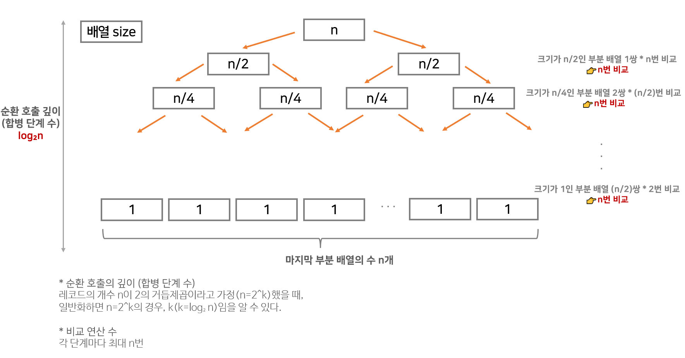

# Merge Sort (합병 정렬)
_John von Neumann_

* `안정 정렬`   
> **안정 정렬**  
> 중복된 값을 입력 순서와 동일하게 정렬. (정렬하기 전/후 순서가 유지된다.)  
> 대표적으로 `삽입정렬(insertion sort)`, `병합정렬(merge sort)`, `버블정렬(bubble sort)`이 있다.  
> _불안정 정렬은 중복된 값이 입력 순서와 동일하지 않게 정렬. 대표적으로 `퀵정렬(quick sort)`, `선택정렬(selection sort)` 등_

* `분할 정복 알고리즘(divide and conquer)`  
> **divide and conquer**  
> 문제를 작게 분리하고 해결한 다음 결과를 모아 원래 문제 해결하는 전략으로 대개 순환 호출을 이용하여 구현한다.  
 
* 길이가 0 또는 1이면 이미 정렬된 것으로 본다. 그렇지 않은 경우는 정렬되지 않은 영역을 절반으로 잘라 두 개로 나눈다.  

## Merge sort 알고리즘 개념
: 하나의 영역을 2 개의 균등한 크기로 분할하고 분할된 부분 영역을 정렬한 다음, 정렬된 2개의 부분 영역을 합하면서 정렬한다.  
* **분할(divide)**: 입력 배열을 같은 크기의 2개의 부분 배열로 분할  
* **정복(conquer)**: 부분 배열 정렬. 부분 배열의 크기가 충분히 작지 않으면 순환 호출을 이용하여 다시 분할 정복 적용  
* **결합(combine)**: 정렬된 부분 배열들을 하나의 배열에 합병  

합병 대상이 되는 두 배열이 이미 정렬되어 있기 때문에, 단순히 두 배열을 순차적으로 비교하면서 정렬할 수 있다.  
### 2개의 정렬된 배열을 합병하는 과정  
1. 두 배열의 값들을 처음부터 하나씩 비교해가며 더 작은 값을 새로운 배열로 옮긴다. 👉 sorted!
2. 두 배열 중 하나가 끝날 때 까지 되풀이
3. 하나가 먼저 끝나면 나머지 배열의 값들을 전부 새로운 배열로 복사한다. 
4. 새로운 배열을 원래 배열로 옮긴다. 

### Merge Sort 단점
1. 레코드가 배열(Array)인 경우, 임시 배열(Array) 필요
2. 레코드 크기 큰 경우, 시간적 낭비 초래
### Merge Sort 장점
1. 안정적인 정렬 방법. 데이터 분포에 영향을 덜 받는다. 정렬되는 시간은 항상 O(nlog₂n)
2. 레코드가 LinkedList인 경우, link index만 변경되므로 데이터의 이동은 무시할 정도로 작아진다.
3. 크기가 클 수록, LinkedList일 경우 merge sort의 진가를 발휘한다.!

## 시간복잡도
1. 분할단계  
: 비교 연산과 이동 연산이 수행되지 않는다.
2. 합병단계  
* 비교 횟수  

* 이동 횟수
  * 순환 호출의 깊이 (합병 단계의 수)  
    : k=log₂n 
  * 각 합병 단계의 이동 연산  
    : 임시 배열에 복사했다가 다시 가져와야 되므로 이동 연산은 총 부분 배열에 들어 있는 요소의 개수가 n인 경우, 레코드의 이동이 2n번 발생한다. 
  * 순환 호출의 깊이 만큼의 합병 단계 * 각 합병 단계의 이동 연산 = 2nlog₂n
* nlog₂n(비교) + 2nlog₂n(이동) = 3nlog₂n = O(nlog₂n)

### Quick sort와의 차이점
|Merge Sort|Quick Sort|
|---|---|
|영역을 쪼갤 수 있는 만큼 쪼갠 후 합병하며 정렬한다.|pivot을 통해 우선 정렬한 후, 영역을 쪼갠다.|
|순차접근|임의접근|
👉 LinkedList 정렬시, Quick Sort보다는 Merge Sort가 더 좋다.  

  

[참고](https://gmlwjd9405.github.io/2018/05/08/algorithm-merge-sort.html)
