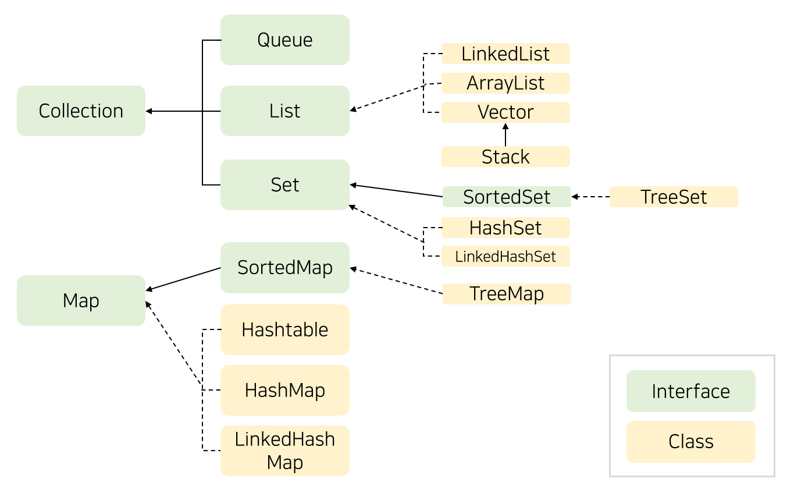

## List / Set / Map

|List|Set|Map|
|-----|-----|-----|
|인덱스로 관리|원소 집합 자체로 관리|(key, value)값으로 관리|
|순서가 있다.|순서없다.|순서 없다.|
|원소 중복 허용|원소 중복 허용 안 함|원소 중복 허용 (key 중복 안 되고, value는 상관 없음)|

 

### List
* ArrayList 검색 빠름
* LinkedList 포인터 구조. 삽입/삭제 빠름  

[참고] [Array와 LinkedList](Array_vs_LinkedList.md)

### Set
* HashSet: 인스턴스 hash값 기준으로 저장 👉 순서 보장 안 됨, NULL허용
* LinkedHashSet: 입력 순서 보장
* TreeSet: 이진탐색트리 기반. 데이터들이 오름차순으로 정렬된다. 삽입/삭제 느리지만 검색 빠름

### Map
* HashMap: key중복 안 됨. 순서 보장 안함. key, value 둘 다 NULL 가능. 검색 성능 뛰어남. 동기화 보장 안 됨
* HashTable: key, value 둘 다 NULL 안 됨. 동기화 보장됨 (synchronized 예약어)
* LinkedHashMap: 입력 순서 보장
* TreeMap: 이진탐색트리 기반. key값 기준으로 오름차순 정렬. 데이터 입력 시, 정렬해서 느림

