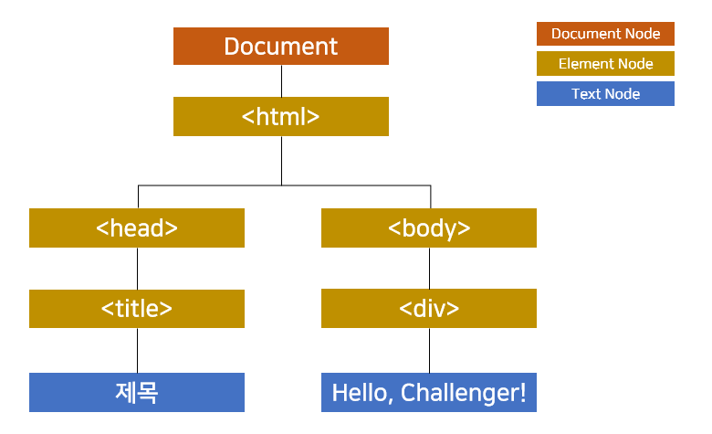
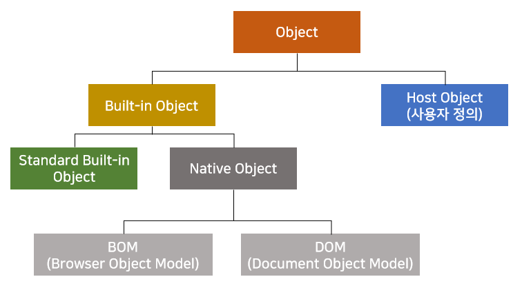

## DOM Document Object Model
HTML과 XML 문서의 구조를 정의하는 API를 제공합니다.  
문서 내의 모든 요소를 정의하고 각각의 요소에 접근하는 방법(프로퍼티, 메소드)을 제공합니다.  


W3C DOM 표준은 세 가지 모델로 구분됩니다.  
1. Core DOM : 모든 문서 타입을 위한 DOM 모델
2. HTML DOM : HTML 문서를 위한 DOM 모델
3. XML DOM : XML 문서를 위한 DOM 모델

<BR/>
<BR/>

#### HTML DOM

``` javascript
<!DOCTYPE html>
<html>
    <head>
        <title>제목</title>
    </head>
    <body>
        <div>Hello, Challenger!</div>
    </body>
</html>
```

  

문서 요소 집합을 tree 형태의 계층 구조로 `HTML`을 표현합니다.  
DOM은 HTML 문서의 내용을 조작할 수 있는 API로 HTML을 계층 구조 형식의 객체로 표현합니다.  
DOM으로 HTML 문서의 추가, 수정, 삭제가 가능합니다.   
Javascript를 사용하여 DOM에서 발생하는 이벤트를 감지하여 이벤트에 대응하는 여러 작업 수행이 가능합니다.


- 자바스크립트는 새로운 HTML 요소나 속성을 추가할 수 있습니다.
- 자바스크립트는 존재하는 HTML 요소나 속성을 제거할 수 있습니다.
- 자바스크립트는 HTML 문서의 모든 HTML 요소를 변경할 수 있습니다.
- 자바스크립트는 HTML 문서의 모든 HTML 속성을 변경할 수 있습니다.
- 자바스크립트는 HTML 문서의 모든 CSS 스타일을 변경할 수 있습니다.
- 자바스크립트는 HTML 문서에 새로운 HTML 이벤트를 추가할 수 있습니다.
- 자바스크립트는 HTML 문서의 모든 HTML 이벤트에 반응할 수 있습니다.


<br/>

#### Object



<br/><br/>
<details>
<summary>참고</summary>

[DOM은 정확히 무엇일까? [번역]](https://wit.nts-corp.com/2019/02/14/5522)   
[DOM의 개념](http://tcpschool.com/javascript/js_dom_concept)
</details>
