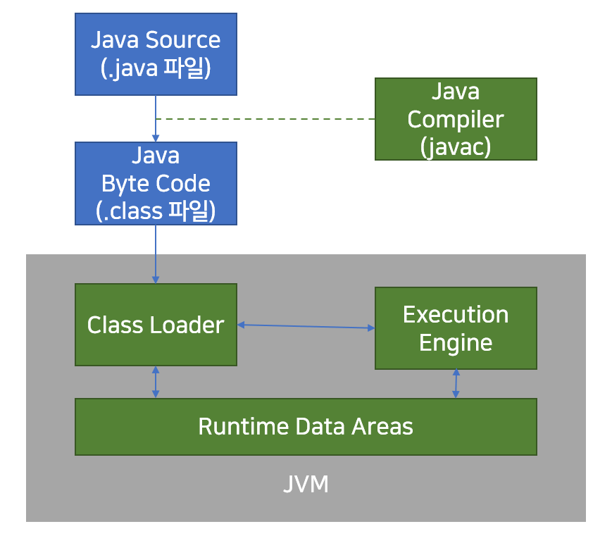
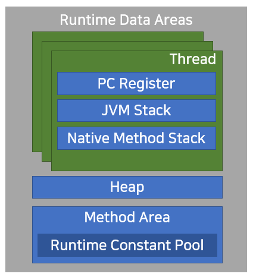

### Write Once, Run Anywhere?
일반적으로 컴파일 언어(ex. C++, C, Swift)는 _(소스 코드 → 컴파일 → 기계어)_ 운영체제(플랫폼)에 종속적입니다.  
하지만 자바는 컴파일로 얻은 결과물이 .class 파일로 _(바이너리 코드(기계어)가 아닌 **바이트 코드**)_ JVM이 바이트 코드를 읽어주어 OS에 상관없이 실행됩니다.  

<br/>

### 가비지 컬렉션 garbage collection (GC)
더 이상 사용하지 않는 메모리를 자동으로 정리하는 기능입니다.  
_GC는 우리가 언제 발생하는 지 알 수 없습니다. 그저 언젠간 이뤄진다는 걸 알아두면 됩니다..!_

<br/>

### 자바 기본형 데이터 타입(Primitive Type)과 참조형 데이터 타입(Reference Type)
* **기본형 데이터 타입 Primitive Type**  

미리 정해진 크기의 메모리 사이즈로 표현되며 변수 자체에 값이 저장됩니다.  
byte(1 byte), short(2 byte), int(4 byte), long(8 byte), float(4 byte), double(8 byte), Boolean, char(2 byte)  
총 8가지 입니다.  
타입의 표현 범위가 커지는 방향으로 할당할 경우, 묵시적 형변환이 발생합니다.  
  * byte → short → int → long → float → double  
  * char → int 

명시적 형변환 같은 경우는 값 손실이 발생할 수 있으므로 개발자 책임 하에 형변환 진행할 수 있으며,  
묵시적 형변환 같은 경우는 자료의 손실 걱정이 없어 JVM이 서비스 해줍니다.

<br/>

* **참조형 데이터 타입 Reference Type**  

미리 정해질 수 없는 데이터를 표현하며 변수에는 실제 값을 참조할 수 있는 주소만 저장합니다.  
new 키워드 실행 시, 변수에는 실제 값을 참조할 수 있는 참조 값이 들어갑니다.  
참조형은 기본 데이터 타입을 제외한 모든 데이터 타입입니다.  
보통 String, int[], 사용자가 정의한 타입 등이 있습니다.  

<br/>

* **선언 위치에 따른 변수 분류**

|종류|변수종류|선언위치|
|:---:|:---:|:---:|
|멤버변수|클래스 멤버 변수|클래스 영역<br/>(static keyword)|
|멤버변수|인스턴스 멤버 변수|클래스 영역|
|지역변수|지역 변수|함수내부|
|지역변수|파라미터 변수|함수 선언부|

``` java
public class Challenge {
  static int classVar; // 클래스 멤버 변수
  int instanceVar; // 인스턴스 멤버 변수
  
  public static void main(String[] args) { // 파라미터 변수
    int localVar = 0; // 로컬 변수
    
    ...
    
  }
}
```
* **클래스 멤버 변수**  
  * 클래스 영역에 선언됨 static 키워드 붙음
  * 클래스 영역에 클래스 로딩 시 메모리에 등록된다. (모든 객체가 공유하게 되어 *공유변수*라고도 부른다.)
  * 객체 생성과 무관하게 클래스 이름으로 접근 가능하다.
  * 프로그램 종료 시 소멸된다.
* **인스턴스 멤버 변수**  
  * 클래스 영역에 선언된다.
  * 객체가 만들어질 때 객체별로 생성된다. (생성 메모리 영역: heap) _JVM 메모리구조 참고_
  * 객체 생성 후 객체 이름으로 접근
  * GC에 의해 소멸된다. (개발자는 못함)
* **지역변수와 파라미터 변수**  
  * 클래스 영역 이외 모든 중괄호 안에 선언된다.
  * 선언된 라인이 실행될 때 변수가 생성된다. (생성 메모리 영역: thread별로 생성된 stack)
  * 사용하기 전 명시적 초기화 필요하다. 
  * 선언 영역 {} 을 벗어나면 소멸된다. 

<br/>

### switch 문에서 dobule은 사용 불가능하다.  
- byte, short, char, int 가능  
- enum 가능
- class object (Byte, Short, Character, Integer, String) 가능  
- method 호출 가능  

<br/>

### 객체 지향 프로그래밍 (Object Oriented Programming)
블록 형태의 모듈화된 프로그래밍 👉 추가, 삭제, 수정 용이하며 재사용성이 높습니다.    
현실세계에 있는 객체가 갖고 있는 속성과 기능은 추상화(abstraction)되어 클래스에 정의됩니다.  
클래스는 구체화되어 프로그램의 객체(instance, object)가 됩니다.  
* 클래스: 객체를 정의해 놓은 것, 객체의 설계도/틀 이라고 보면 됩니다. _붕어빵 틀_
* 객체: 메모리에 생성된 데이터로 클래스를 구체화한 것입니다. _붕어빵_

* instance vs object? 나누기 애매하지만.. 굳이 나누자면!  
  * object: 클래스 타입으로 선언되었을 때 (구현할 대상)
  * instance: object가 메모리에 할당되었을 때 (구현된 실체)

<br/>

### JVM 메모리 구조  
JVM(Java Virtual Machine)은 JRE 위에서 자바 바이트 코드를 동작(해석/실행)시키는 중요 요소입니다.  
자바 애플리케이션을 클래스 로더(Class Loader)를 통해 읽어 자바 API와 함께 실행합니다.  
_JRE는 자바 API와 JVM으로 구성된다._  
GC를 이용하여 메모리 관리를 하는 Stack 기반의 가상머신입니다.  


클래스 로더가 컴파일된 자바 코드를 런타임 데이터 영역(Runtime Data Areas)에 로드하고, 실행 엔진(execution engine)이 자바 바이트 코드를 실행한다.  

* 런타임 데이터 영역(Runtime Data Areas)  

  

JVM이라는 프로그램이 운영체제 위에서 실행되면서 할당받는 메모리 영역입니다.  
총 6개의 영역으로 나눌 수 있는데, 
PC레지스터, JVM 스택, 네이티브 메서드 스택은 **스레드 하나씩 생성**되며  
힙, 메서드 영역, 런타임 상수 풀은 **모든 스레드가 공유**합니다.  

**메서드 영역**은 모든 스레드가 공유하는 영역으로 클래스 원형을 로드합니다. 필드정보, 메서드 정보, static 변수, 메서드의 바이트코드 등을 보관합니다.  
**JVM 스택**은 메서드들의 실행 공간으로 각 스레드마다 하나씩 존재하며 스레드가 시작될 때 생성됩니다.  
**힙**은 모든 스레드가 공유하는 영역입니다. 인스턴스 또는 객체를 저장하는 공간으로 GC 대상입니다. _(생성된 객체를 개발자가 삭제 못한다.)_ JVM 성능 등 이슈에서 가장 많이 언급되는 공간입니다.  
