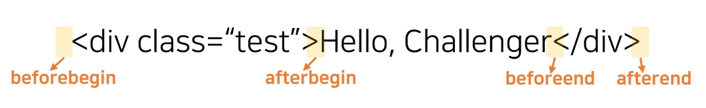

DOM API에서 노드를 추가하는 방법은 여러 가지가 있다.

## innerHTML
``` javascript
element.insertHTML(text);
```
- 장점
  - 쉽고 간단하다.
- 단점
  - 기존 노드의 모든 자식 노드를 제거하고 할당한 HTML 마크업 문자열을 파싱하여 DOM을 변경한다.
  - 중간에 새로운 요소 삽입하기 어렵다.
  - DOM요소를 인자로 넘겨주기 때문에 입력값 등을 통해 악의적 스크립트가 실행되는 크로스 사이트 스크립팅 공격에 취약하다. 

``` javascript
const el = document.querySelector("#el");
for(var i=0; i<1000; i++) {
    el.innerHTML += "<div>Hello World</div>";
}
```
👉 기존 노드를 제거하고 추가하기 때문에 비효율적이다.

``` javascript
const el = document.querySelector("#el");
let temp = "";
for(var i=0; i<1000; i++) {
     temp += "<div>Hello World</div>";
}
el.innerHTML = temp;
```
👉 변수 생성 후 DOM String 을 축적하여 한 번만 사용하는 것이 바람직하다.  
`Loading`, `Scripting` 성능 비교시, DOM String 사용하는 게 훨씬 빠르다.

## insertAdjacentHTML
``` javascript
element.insertAdjacentHTML( position, text );
// position에는 4 종류가 있다. -> beforebegin, afterbegin, beforeend, afterend
```
innerHTML의 단점을 보완하기 위해 만들어졌다.    

- 장점
  - 기존 요소 제거하지 않고 위치 지정하여 추가 가능하다.
  - innerHTML보다 빠르다.
- 단점
  - 크로스 사이트 스크립팅 공격에 취약
  - 익스플로러에서 지원하지 않는다.

## appendChild
- 장점
  - 기존 요소를 제거하지 않고 위치를 지정하여 추가 가능하다.
  - 인자로 DOM String이 아닌 Node를 받기 때문에 보안이슈 상대적으로 없다.
- 단점
  - Node를 인자로 전달하기 때문에 자식 노드를 생성해야 한다.

## insertBefore
``` javascript
var insertedNode = parentNode.insertBefore(newNode, referenceNode);
// referenceNode 가 null 이라면, newNode 가 자식 노드의 리스트의 끝에 삽입
// referenceNode 는 선택 인자가 아니다. 
```
- 장점
  - 기존 요소를 제거하지 않고 위치를 지정하여 추가 가능하다.
  - 기존 부모 노드에서도 굳이 삭제 할 필요 없이 자동으로 이동 가능하다.
  - 인자로 DOM String이 아닌 Node를 받기 때문에 보안이슈 상대적으로 없다.
- 단점
  - Node를 인자로 전달하기 때문에 자식 노드를 생성해야 한다.

``` javascript

...

  <div id="list">
    <p id="itemA">A</p>
    <p>B</p>
    <p id="itemC">C</p>
  </div>
  
...

  <script>
    let el = document.querySelector("#itemA");
    let parent = document.querySelector("#list");
    
    parent.insertBefore(el, null); // 맨 끝에 삽입
    parent.insertBefore(el, parent.firstChild); // 부모의 첫 번째 노드로 입력
    parent.insertBefore(el, itemC); // itemC 앞으로 이동
  </script>
```

<br/><br/>

---

insertAdjacentHTML과 appendChild는 속도는 비슷하지만 편의성은 insertAdjacentHTML, 보안성은 appendChild 우세!  
DOM 조작 최소한으로 하는 것이 성능 향상과 연관되어 있다. 👉 브라우저 렌더링 공부해보기

<BR/>
<BR/>
<BR/>

[참고](https://www.youtube.com/watch?v=q1fQnGG1bgU)
