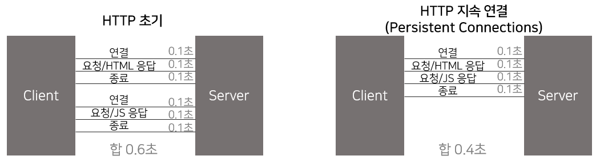

# HTTP 
**HyperText Transfer Protocol**  
HTTP를 이용하여 HTML, TEXT, 이미지, 영상, JSON, XML (API) 등 모든 형태의 데이터 전송이 가능하다.  
서버 간 데이터를 주고 받을 때에도 대부분 HTTP를 사용한다.  
_TCP직접 연결은 게임서버 또는 다른 특수한 경우에만 사용된다고 합니다._

* HTTP/1.1  
1997년에 나온 버전으로 현재 가장 많이 사용되고 있는 버전입니다. 대부분의 기능을 갖고 있습니다.  
* HTTP/2  
2015년에 성능 개선이 이루어졌습니다.
* HTTP/3  
현재 진행 중으로 TCP 대신 UDP를 사용하며 성능 개선이 초점에 맞춰져 있습니다.

_HTTP/2와 HTTP/3은 성능개선에 초점이 맞춰져 있으며 HTTP/1.1에 이미 기능들이 거의 다 갖추고 있다고 합니다._

### HTTP 특징
* **클라이언트 서버 구조**  
클라이언트는 서버에 요청(request)을 보내고 서버는 요청에 대한 결과를 만들어 응답(response)
* **무상태 프로토콜(stateless), 비연결성(connectionless)**  
  * 서버가 클라이언트 상태를 유지하지 않는다. (서버 무한 증설 가능)
  * 연결을 유지하지 않아, 초 단위 이하의 빠른 속도 응답이 가능하다. 
* **HTTP메시지를 이용하여 데이터 주고 받음**  
* **단순하고 확장 가능하다.**  

<br/>

### stateless의 한계  
하지만, 우리는 로그인 상태를 유지해야 하는 경우가 있다..!   
이런 경우에는 일반적으로 **브라우저 쿠키와 서버 세션**을 사용한다.  


### connectionless의 한계  
연결할 때마다 TCP/IP 연결을 맺어야 한다.  
HTML뿐만 아니라 자바스크립트, CSS, 이미지 등 수많은 자원이 함께 다운로드 된다.  
  👉 **HTTP 지속 연결 (Persistent Connections)** 로 문제 해결 가능하며, HTTP/2와 HTTP/3에 더 최적화되어 있다.  




## HTTP 메시지
* 공식 스펙
``` pseudo
HTTP-message = start-line
              * (header-field CRLF)
              CRLF
              [ message-body ]
```

### 1. start-line
> |HTTP 메서드| |요청 대상| |HTTP version|   

### 2. header-field
> field-name":" field-value  

field-name은 대소문자 구분이 없다.  
field-name과 ":"는 꼭 붙여 써야 된다.  
field-value는 띄어써도 상관 없다.  

HTTP 전송에 필요한 모든 부가정보(브라우저 정보 등)를 갖고 있다. 필요시 임의의 헤더도 추가 가능하다.  

### 3. message-body
실제 전송할 데이터로 HTML, 이미지, 영상, JSON 등 byte로 표현 가능한 모든 데이터 전송 가능하다.  


## HTTP 메서드
* **GET**: 리소스 조회
  * 서버에 전달할 데이터를 쿼리 파라미터(쿼리 스트링)를 통해 전달
* **POST**: 요청 데이터 처리
  * 메시지 바디를 통해 서버로 요청 데이터 전달
  * 프로세스 처리해야 하는 경우 보통 POST를 사용한다. 
    * 회원가입, 주문, 게시판 글 작성, 내용 추가 등..
  * 다른 메서드 처리 애매한 경우 POST 사용한다.
* **PUT**: 리소스 (완전히) 대체, 해당 리소스 없으면 새로 생성
  * POST와의 차이점은 클라이언트가 리소스 위치를 알고 URI를 지정한다.
* **PATCH**: 리소스 부분 변경 
* **DELETE**: 리소스 삭제 
* HEAD: GET과 동일하지만 메시지 부분 제외하고 상태 줄과 헤더만 반환 (바디는 안 받는다.)
* OPTIONS: 대상 리소스에 대한 통신 가능 옵션(메소드)을 설명 (주로 CORS에서 사용한다.)
* CONNECT: 대상 자원으로 식별되는 서버에 대한 터널을 설정 (거의 사용 안 한다.)
* TRACE: 대상 리소스에 대한 경로를 따라 메시지 루프백 테스트 수행 (거의 사용 안 한다.)

### HTTP 메서드 속성
* **Safe Method**  
호출해도 리소스 변경 안 됨 👉 GET, HEAD  
* **Idempotent 멱등**  
한 번 호출하든 여러 번 호출하든 결과 같음 👉 GET, PUT, DELETE  
_POST는 멱등이 아니다._
* **Cache 캐시 가능**   
응답 결과 리소스를 캐시해서 사용가능 👉 GET, HEAD, POST, PATCH


## HTTP 상태코드
* 1XX: 요청 수신되어 처리 중 - 실무에서 거의 사용하지 않는다.
* 2XX: 요청 정상 처리
  * 200 OK
  * 201 Created: 요청 성공하여 새로운 리소스 생성됨
  * 202 Accepted: 요청 접수되었으나 아직 처리 완료되지 않음
  * 204 No Content: 요청 성공했지만 응답으로 보낼 데이터 없는 경우 ex) 웹 문서 수정 내용 저장하는 경우
* 3XX: Redirection - 응답 결과에 Location 헤더 있는 경우, 그 위치로 redirect한다.
  * 300 Multiple Choices
  * 301 Moved Permanently: 리다이렉트 시 요청 메서드가 GET으로 변하고 본문이 지워질 수 있음
  * 302 Found: 301과 유사
  * 303 See Other: 리다이렉트 시 요청 메서드가 GET으로 변경 
  * 304 Not Modified: 캐시를 목적으로 많이 사용된다. (캐시로 리다이렉트)
  * 307 Temporary Redirect: 리다이렉트 시 요청 메서드와 본문 유지 (무조건!)
  * 308 Permanent Redirect: 리다이렉트 시 요청 메서드와 본문 유지
* 4xx: Client 오류
  * 400 Bad Request: 잘못된 요청파라미터, api 스펙
  * 401 Unauthorized: 인증이 필요함
  * 403 Forbidden: 서버의 승인 거부. 접근 권한 불충분 (일반 사용자가 운영자 메뉴 접근할 때)
  * 404 Not Found: 요청 리소스가 서버에 없음 (보통 개발할 때에는 오타 때문에 많이 발생)
  * 405 METHOD_NOT_ALLOWED: 잘못된 HTTP Method로 요청함
* 5xx: Server 오류
  * 500 Internal Server Error: 서버 내부 문제
  * 503 Service Unavailable: 서비스 이용 불가 (과부하 또는 예정 작업 진행으로 인한 이용 불가능)


_만약 모르는 상태 코드가 나온다면?_ 👉 상위 상태코드 (맨 앞 숫자) 보고 처리


