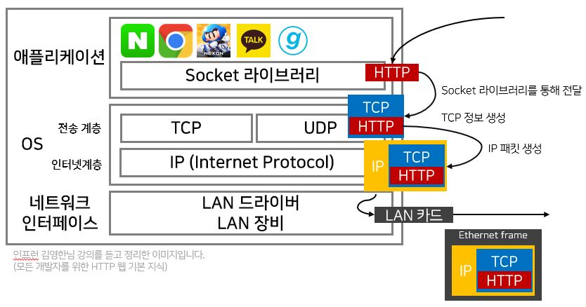

IP(인터넷 프로토콜)은 멀리 있는 서버/클라이언트와 통신하기 위해 필요합니다.  
지정한 IP 주소에 Packet(패킷)이라는 통신 단위로 데이터가 전달됩니다.  
전송 데이터에 출발지 IP, 목적지 IP 등 정보를 담은 IP 패킷을 감싸서 데이터를 전달합니다.  
목적지 IP는 해당 데이터를 받고, IP 패킷에 적혀있는 출발지 IP로 응답 패킷을 전달합니다.  

 

  
### IP프로토콜은 
1. 패킷을 받을 대상이 없거나 서비스가 불능한 상태여도 패킷을 전송하게 됩니다.  
  👉 **비연결성**
2. 위의 조건이 만족되더라도 중간에 패킷이 사라지거나 패킷이 순서대로 오지 않을 수도 있습니다.   
  (패킷용량이 크면 나눠서 전송하게 되어 순서가 지켜지지 않으면 문제가 발생할 수 있습니다.)  
  👉 **비신뢰성**
3. 노래를 들으면서 게임을 하는 것 처럼 같은 IP에서 통신하는 애플리케이션이 2개 이상일 때, IP 프로토콜만으로는 프로그램 구분이 가지 않습니다.

우리는 <b>TCP 프로토콜</b>로 이 문제를 해결할 수 있습니다.
   
우선 프로토콜 계층은 다음과 같이 구성되어 있습니다.  

TCP 정보에는 출발지 port, 목적지 port, 전송 제어, 순서, 검증 정보 등 들어 있으며,  
TCP 세그먼트 덕에 신뢰할 수 있는 protocol로 진화할 수 있었습니다.
  
### TCP (Transmission Control Protocol)
TCP 특징으로는 **3-Way handshake**로 데이터 전달 보장은 물론이며 순서 보장도 됩니다.  
(3-Way handshake는 프로토콜을 이용하여 데이터 전송 전 전달 보장을 위해 상대방 컴퓨터와 사전에 세션을 수립하는 과정입니다.
클라이언트가 SYN(접속요청)을 보내면 서버는 SYN과 함께 ACK(요청수락)를 보냅니다. 이를 받은 클라이언트는 서버에게 ACK를 보냄으로써 연결이 됩니다.)  
 
### UDP (User Datagram Protocol)
3-Way handshake 기능이 없어 데이터 전달도 순서 보장도 되지 않습니다.

> UDP 역할 = IP 패킷과 거의 같은 역할 + PORT 역할 + 체크섬  

_체크섬? 메시지가 제대로 왔는지 검증해주는 역할_  

하지만 단순하고 빨라 최근(HTTP/3)에서 각광받고 있다고 합니다.  
(Web browser에서 HTTP 통신시 TCP 3-way handshake가 갖는 시간조차 아까운..!)  
참고로, 우리에게는 HTTP/1.1가 가장 많이 사용되며 중요한 버전입니다.

 

### Port
같은 IP내에서 프로세스 구분해주는 역할  
_IP가 아파트면 PORT는 동호수로 생각하면 됩니다._ 

 

### DNS (Domain Name System)
일종의 _전화번호부_ 같은 역할로, 도메인 명을 IP주소로 변환해줍니다.  
도메인 명을 보내면 DNS 서버는 IP주소로 응답해줍니다. 우리는 이 IP주소를 통해 서버에 접속합니다.