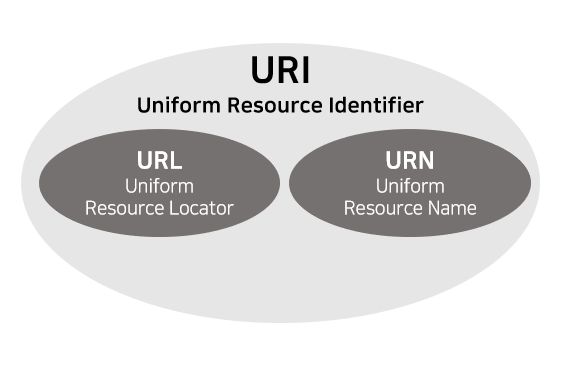
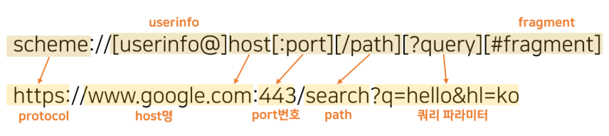

## URI (Uniform Resource Identifier)
* identifier: 다른 항목과 구분하는데 필요한 정보   

URI는 로케이터(URL), 이름(URN), 또는 둘 다 추가로 분류될 수 있다.

 
  
### URN
리소스에 이름을 부여
  

### URL
리소스가 있는 위치 지정

 
 

> **URL 전체 문법**

* **scheme**: 주로 프로토콜을 사용한다. _(protocol? 어떤 방식으로 자원에 접근할 건지 클라이언트와 서버간의 약속 규칙)_
* **useinfo**: URL에 사용자정보를 포함해서 인증한다.
* **host**: 도메인명 또는 IP주소 직접 사용 가능하다.
* **port**: 접속 포트로 일반적으로 생략한다. 생략하게 되면 scheme이 http일 경우 80, https는 443이 된다.
* **path**: 리소스 경로로 계층적 구조로 이루어져 있다.
* **query parameter**: key=value형태로 ?로 시작해서 &으로 추가 가능하다. query string이라고도 불린다. 
* **fragment**: html 내부 북마크 등에 사용한다. 서버에 전송하는 정보가 아니다.

