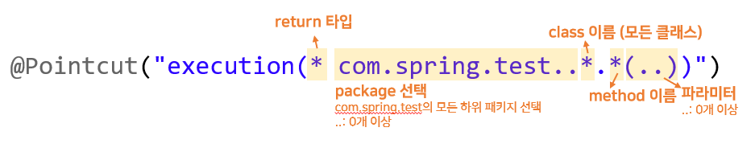
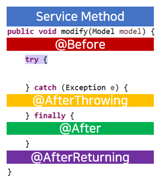

## AOP (Aspect Oriented Programming)

메소드마다 공통으로 등장하는 코드들 👉 복붙하기엔 코드만 길어지고 유지보수하기도 별로다.  
우리는 이런 코드를 공통로직(=공통관심=횡단관심)이라고 부릅니다.  

관심사의 분리를 통해 SW의 모듈성을 향상시킬 수 있습니다!  
공통 모듈을 여러 코드에 쉽게 적용이 가능합니다. 

* AOP 설정

``` xml
    <context:component-scan base-package="AOP 클래스 경로"></context:component-scan>
    <aop:aspectj-autoproxy></aop:aspectj-autoproxy>
```

``` java
@Component // Bean 등록
// 이 클래스가 AOP, 즉 Aspect임을 선언하는 Annotation
// Bean 등록을 하면서 Spring에게 공통 로직이라고 알려준다.
@Aspect 
public class LoggingAspect {

	private static Logger logger = LoggerFactory.getLogger(LoggingAspect.class);
	
	// AOP표현식 - Pointcut 지정
	@Pointcut("execution(* com.spring.test..*.*(..))")
	public void allPointcut() {}
	
	@Around("allPointcut()")
	public Object aroundLog(ProceedingJoinPoint pjp) throws Throwable{
		String method = pjp.getSignature().getName();
		
		StopWatch stopWatch = new StopWatch();
		
		stopWatch.start();
		
		Object object = pjp.proceed(); //proceed 메소드 부분에서 비즈니스로직을 실행
		
		stopWatch.stop();
		System.out.println(method + "() 메소드 수행에 걸린 시간 " + stopWatch.getTotalTimeMillis()+"(ms)");

		return object;
		
	}
}

```

1. Join Point  
공통 로직이 적용될 수 있는 위치(point)로 클라이언트가 호출하는 모든 비즈니스 메서드는 join point가 될 수 있다.

2. Point Cut  
필터링된 join point로 실제 공통로직이 들어갈 포인트 지점이다.  
모든 메서드에서 공통로직이 필요하지 않기 때문에 특정 메소드에만 적용되도록 해야 한다.  

  

3. Advice
공통 기능의 코드를 뜻한다.  
* weaving (위빙)  
: point cut으로 지정한 핵심 관심 메소드가 호출될 때, advice에 해당하는 공통로직이 삽입되는 과정이다.  
  * 시점에 따라 위빙 처리 방식이 나뉜다. 
    - 컴파일 타임 위빙/로딩타임 위빙/런타임 위빙 (Spring 지원)
* Advice 동작 시점  
  
  * `@Before`: 메소드 실행 전
  * `@AfterReturning`: 메소드가 성공적으로 리턴된 후 실행
  * `@AfterThrowing`: 메소드 실행 중 예외가 발생했을 때 실행
  * `@After`: 메소드 실행 후 무조건 실행
  * `@Around`: 메소드 호출 자체를 가로채서 비즈니스 메소드 실행 전후에 처리할 로직 삽입이 가능하다. 위 4개 기능 다 가능하다. 
  


