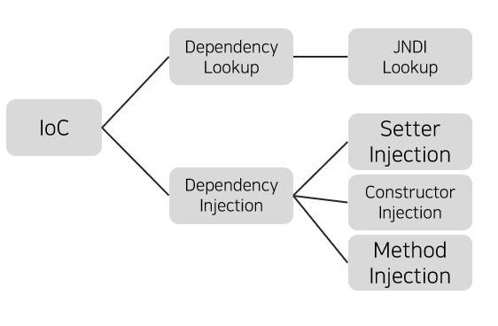

# Spring DI/IoC 

## DI(Dependency Injection) 의존관계 주입
애플리케이션 실행 시점(런타임)에 외부에서 실제 구현 객체를 생성하고 클라이언트에 전달해서 클라이언트와 서버의 실제 의존관계가 연결되는 것  

## IoC (Inversion of Control) 제어의 역전
프로그램의 제어 흐름에 대한 권한을 스프링 컨테이너(@Configuration)가 해준다.  
👉 객체 관계가 좀 더 느슨해짐(loose coupling)  
### IoC 구현 방법

* __Dependency Lookup__  
컨테이너가 lookup context를 통해서 필요한 resource나 object를 얻는 방식   
lookup한 object를 필요한 타입으로 형변환해줘야 한다.  
Naming Exception 처리 로직 필요하다.  
* __Dependency Injection__  
컨테이너가 직접 의존 구조를 object에 설정할 수 있도록 지정해주는 방식  
오브젝트는 컨테이너의 존재 여부를 알 필요 없다.  

  
## Container 컨테이너 
* 객체의 생성, 사용, 소멸 등 라이프 사이클 관리  
* Dependency 객체 제공 (의존관계 연결)  
* Thread 관리  
* 기타 애플리케이션 실행에 필요한 환경 제공  

_IoC컨테이너, DI 컨테이너, 어샘블러, 오브젝트 팩토리_ 등 불리기도 하지만 최근에는 의존관계 주입에 초점을 맞추어 주로 **DI 컨테이너**라고 불린다.

### 필요성
* 비즈니스 로직 외 부가적 기능에 대해서 독립적으로 관리가 가능해진다.
* 서비스 configuration에 대하여 일관적으로 관리 가능하다.  
* 서비스 객체 사용을 위해 직접 Factory 패턴 또는 signleton 패턴으로 구현하지 않아도 된다.  

   

### 빈(Bean)
스프링이 IoC방식으로 관리하는 오브젝트.

### 빈 팩토리(BeanFactory)
스프링이 IoC를 담당하는 핵심 컨테이너  
빈 등록, 생성, 조회, 반환 기능을 담당한다.  
일반적으로 BeanFactory를 바로 사용하지 않고 확장된 ApplicationContext _(스프링이 제공하는 부가 서비스 추가 제공)_ 를 이용한다.  

### 스프링 프레임워크 (Spring Framework)
IoC컨테이너, ApplicationContext를 포함해서 스프링이 제공하는 모든 기능을 통틀어 말한다.  
