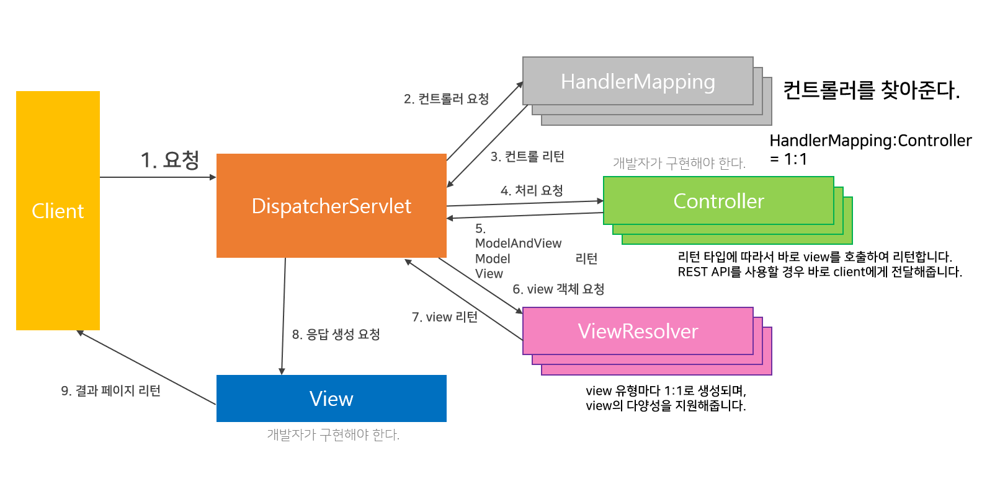

## Spring MVC

### 장점
* 화면과 비즈니스 로직을 **분리해서 작업** 가능하다.
* 영역별 개발로 인하여 **확장성**이 뛰어나다.
* 표준화된 코드를 사용하므로 공동작업이 용이하고 **유지보수성**이 좋다.

### 단점 
* 개발과정이 복잡해 초기 개발속도가 늦다.

### 특징
* Spring은 DI, AOP 기능 뿐만 아니라 Servlet 기반의 WEB개발을 위한 MVC Framework를 제공한다.
* Model2 architecture와 Front Controller Pattern을 프레임워크 차원에서 제공한다.
* 

    
펼치기 🙄🤔

    > **Model2 architecture?**   
    > client요청 처리는 servlet이 하고 logic 처리는 java 클래스 (Service, Dao/Java Beans)가 하고 client에게 출력하는 response page 제공은 JSP가 담당한다.
    > 👉 MVC(Model-View-Controller) pattern을 웹개발에 도입한 구조
    
    > **Front Controller**  
    > DispatcherServlet이 문지기 역할을 하여 모든 클라이언트 요청을 받아 알맞는 컨트롤러에게 클라이언트 요청을 전달한다.
    
    

  
* Spring MVC Framework는 Spring 기반으로 하고 있기 때문에 Spring이 제공하는 트랜잭션 처리나 DI 및 AOP등 쉽게 사용 가능하다.  

 
 

* **DispatcherServlet** (Front Controller)  
모든 클라이언트의 요청을 전달 받는다. 컨트롤러에게 클라이언트의 요청을 전달하고 컨트롤러가 리턴한 결과 값을 view에 전달하여 알맞은 응답을 생성한다.  
* **HandlerMapping**  
클라이언트의 요청 url을 어떤 컨트롤러가 처리할지 결정한다.  
DispatcherServlet은 하나 이상의 Handler Mapping을 갖는다. 
* **Controller**  
클라이언트의 요청을 처리한 뒤 model을 호출하고 그 결과를 DispatcherServlet에게 알려준다.  
리턴되는 데이터는 보통 컨트롤러가 처리한 데이터와 화면에 대한 정보를 갖고 있다. 
* **View Resolver**  
Controller가 리턴한 뷰 이름을 기반으로 컨트롤러의 처리 결과를 보여줄 view를 결정합니다. 
* **View**  
컨트롤러의 처리 결과를 보여줄 응답화면을 생성합니다. 

